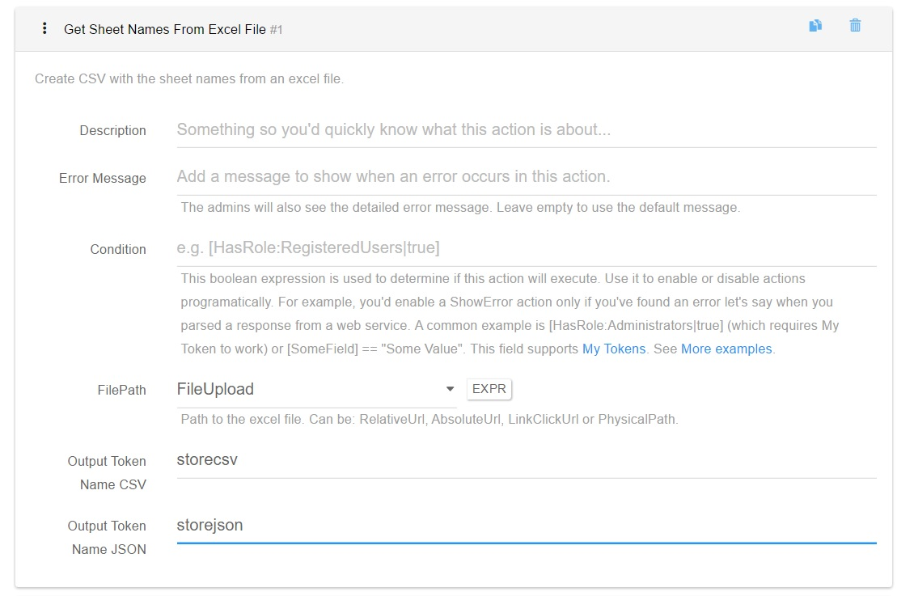

# Get Sheet Names From Excel File

Creates CSV or JSON with the sheet names from an given excel file.

* File Path - the path to the excel file. It supports RelativeUrl, AbsoluteUrl, LinkClickUrl or PhysicalPath sent via a Single File Upload Field -available in Action Form only; .
* Output token name CSV - store the sheet names as CSV so you can reference it later into a Load Entities(CSV) action.
* Output token name JSON -store the sheet names as JSON so you can reference it later by name a Load Entities(JSON) action.
